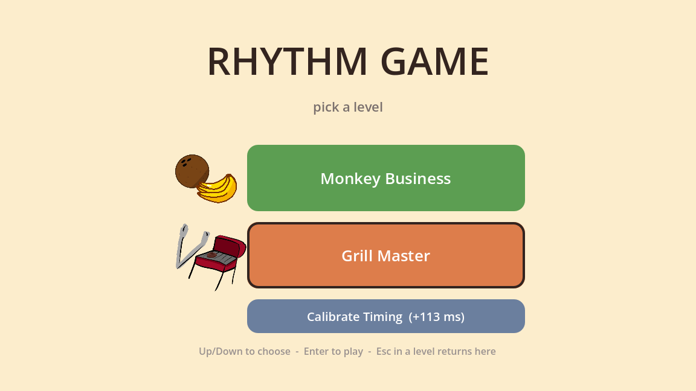
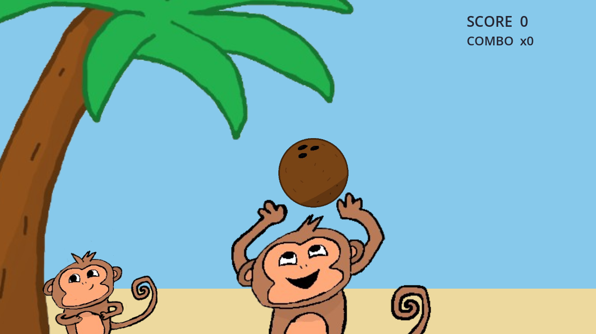
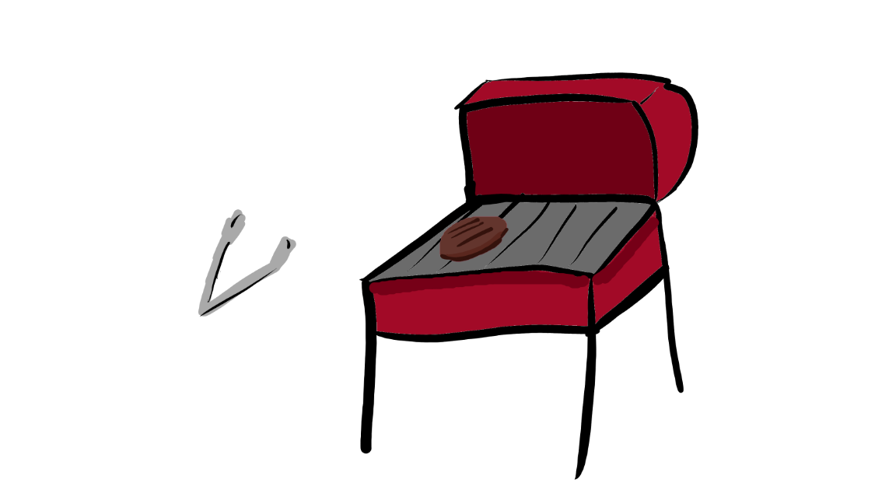
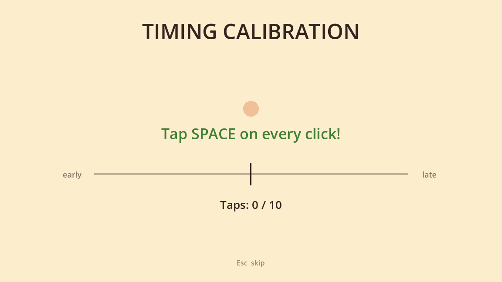

# Rhythm Game

A hand-drawn, Rhythm Heaven–style collection of rhythm minigames, made in Godot.



## Download and play

**[⬇ Download the latest version for Windows](https://github.com/tflicky/rhythm-game/releases/latest)**

1. Download `RhythmGame-…-windows.zip` from the latest release and unzip it.
2. Double-click `RhythmGame.exe`.
3. If Windows shows **"Windows protected your PC"**, click **More info → Run anyway**. The game isn't code-signed, so Windows warns about any small indie `.exe` like this one.

## Minigames

| | |
|---|---|
|  | **Monkey Business.** A monkey hip-bumps the palm tree and coconuts fall. Listen for the cue sound, then catch each one right on the beat. Starts with a short practice round. |
|  | **Grill Master.** Tap the tongs and flip the patty to the beat. *(Work in progress.)* |

## Controls

| Key | Action |
|---|---|
| **Space** / left click | Catch a coconut (Grill Master: tap the tongs) |
| **F** / right click | Grill Master: flip the patty |
| **S** | Skip the practice round (Monkey Business) |
| **R** | Restart the level |
| **Esc** | Back to the menu |
| **Up / Down**, **Enter** | Pick a level on the menu |

## Timing calibration



Every computer has a slightly different delay between pressing a key and hearing a sound. The first time you start the game, it asks you to tap along to a click so it can measure yours. After a 1-2-3-4 count-in, tap **Space** on every click; after 10 taps you'll see your offset and can **Continue** or **Retry**.

The result is saved on that computer only. If catches ever feel early or late, especially after switching to Bluetooth headphones, redo it from **Calibrate Timing** on the main menu.

## Run from source

1. Install [Godot 4.6](https://godotengine.org/download) (standard version, not .NET).
2. Clone this repository, open Godot, and **Import** the `project.godot` file.
3. Press **F5** to play.

To build the `.exe` yourself, install the Windows export templates in Godot (**Editor → Manage Export Templates**), then use **Project → Export → Windows Desktop**.

For how the game works under the hood (the audio-clock timing system, charting levels, adding art and sounds), see **[docs/DEVELOPMENT.md](docs/DEVELOPMENT.md)**.

## Project layout

```
MainMenu.tscn        level select (the game starts here)
Calibrate.tscn       timing calibration
Rhythm.tscn          Monkey Business
Grill.tscn           Grill Master
scripts/             game code (GDScript)
beatmaps/            level charts: which beat each coconut lands on
art/                 drawings (PNG) and their Krita source files (.kra)
audio/               song and sound effects
```

## Credits

Game, art and music by [tflicky](https://github.com/tflicky). Built with [Godot Engine](https://godotengine.org).

All code, art and music are © tflicky, all rights reserved. You're welcome to look around and learn from the code, but please don't reuse the art or music, or redistribute the game, without asking.
